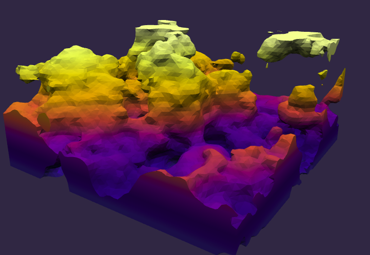
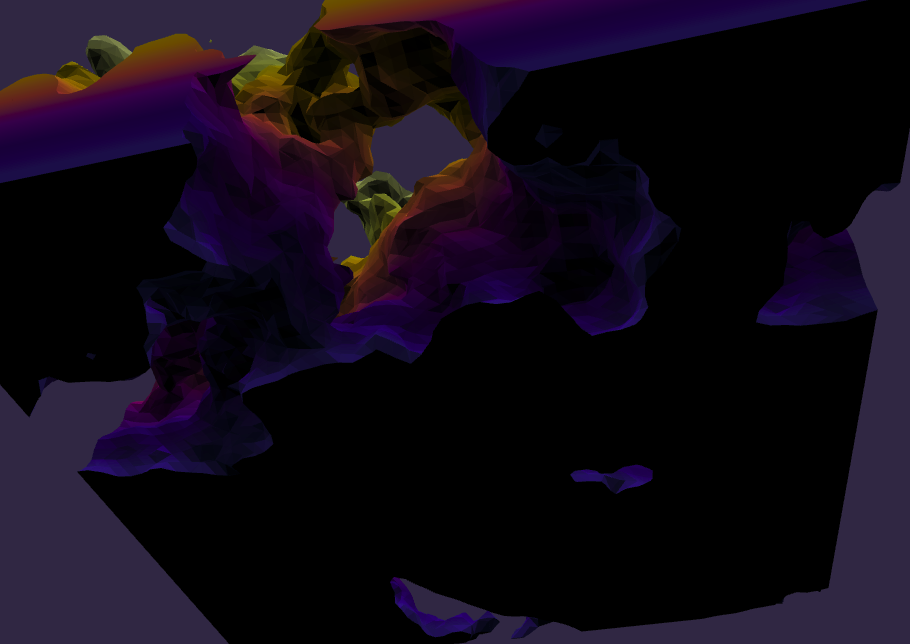
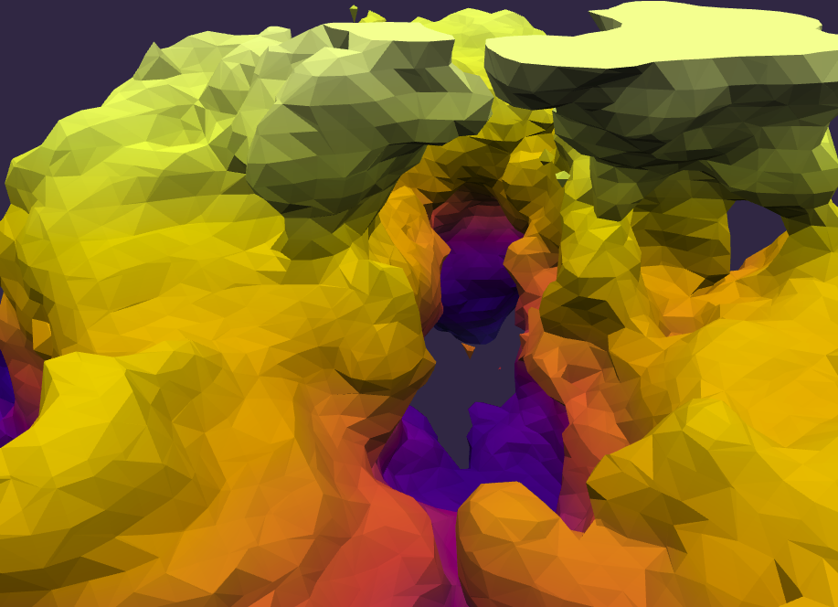
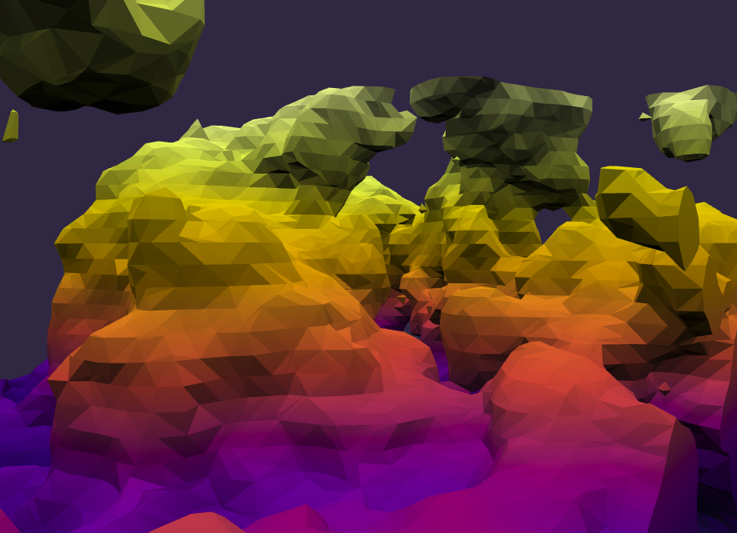
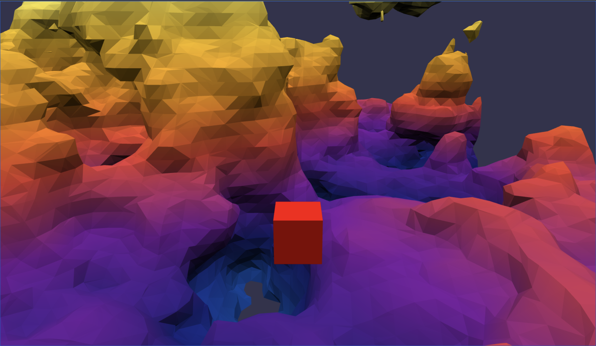

# Marching Cubes

> ### Watch the [Simulation](https://inhibitor1217.github.io/gpu-adventures/marching-cubes/) 🚀

Inspired by [Sebastian Lague](https://github.com/SebLague/Marching-Cubes)'s [Coding Adventure - Marching Cubes](https://www.youtube.com/watch?v=M3iI2l0ltbE).

This project is not available in stable version of Chrome, or major browsers. You need to use Chrome Canary to run it. See [how you can enable WebGPU in Chrome Canary](https://developer.chrome.com/en/docs/web-platform/webgpu/#enabling-via-aboutflags).

